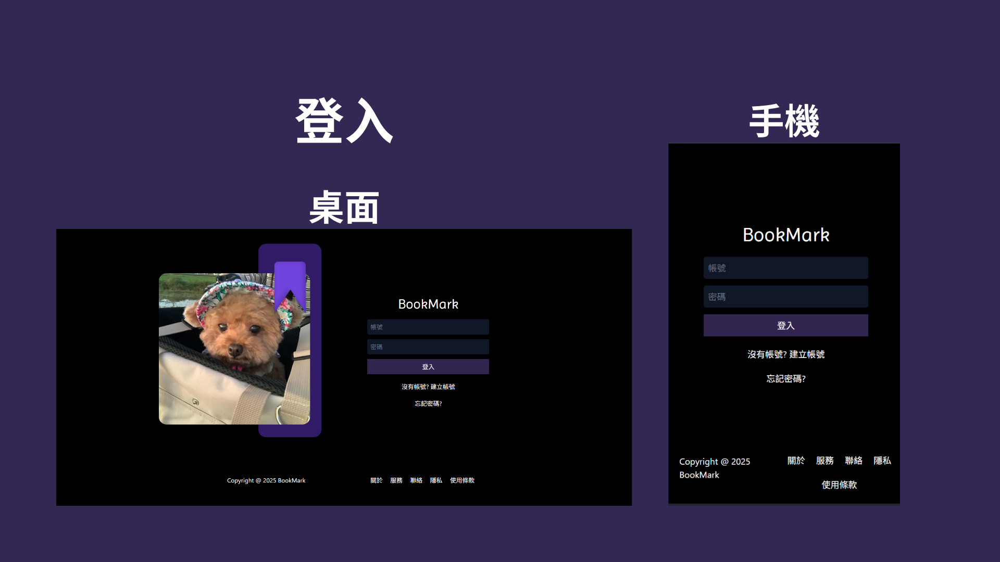
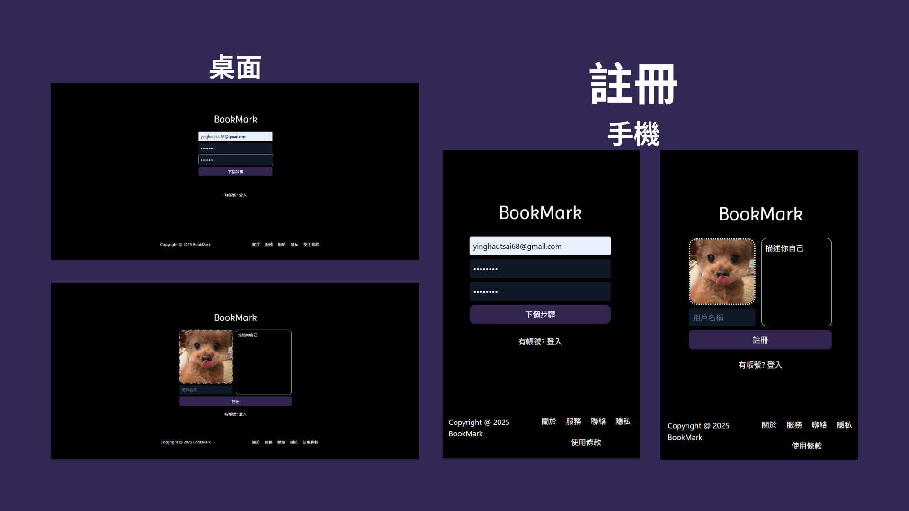
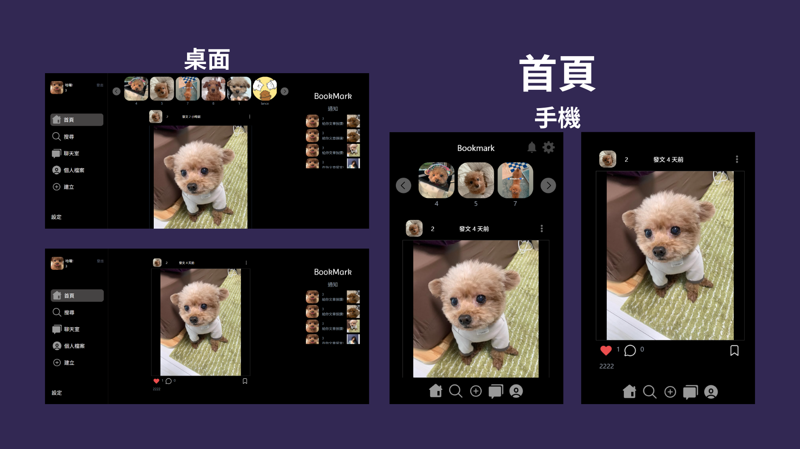
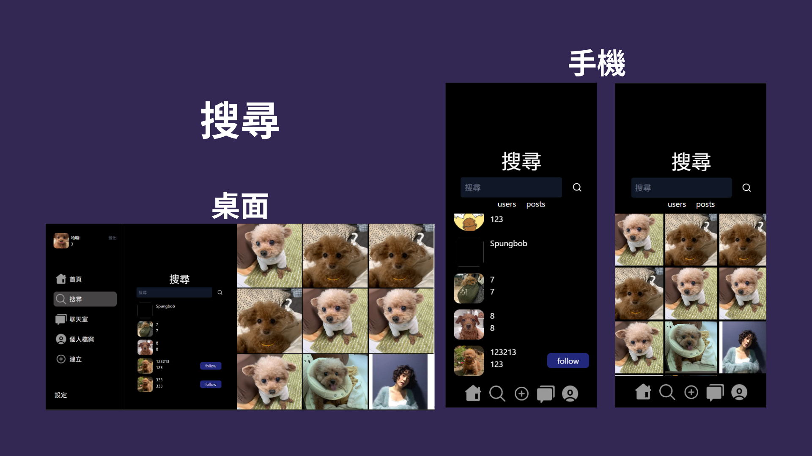
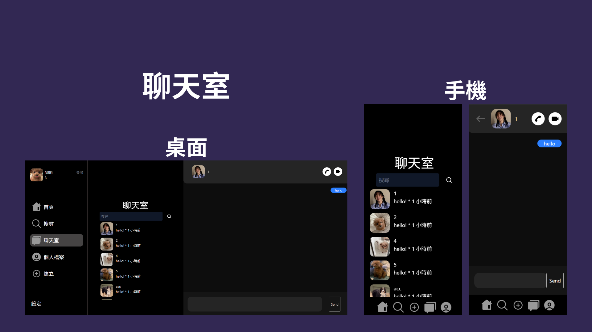
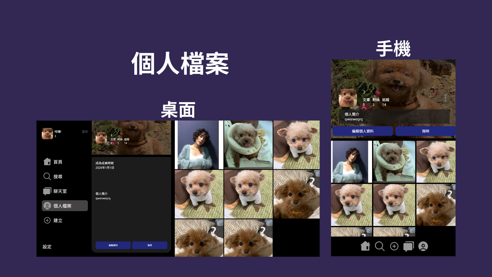
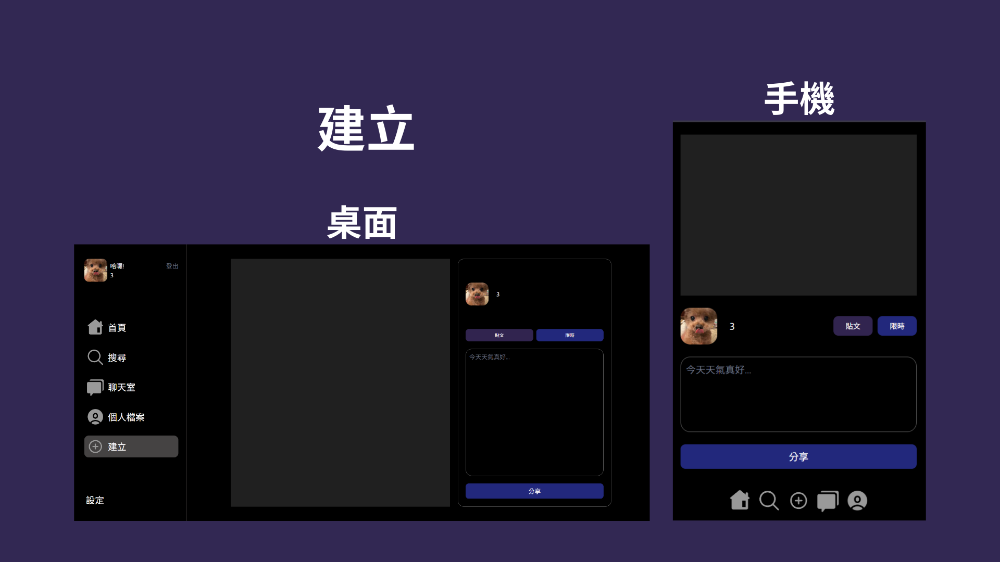
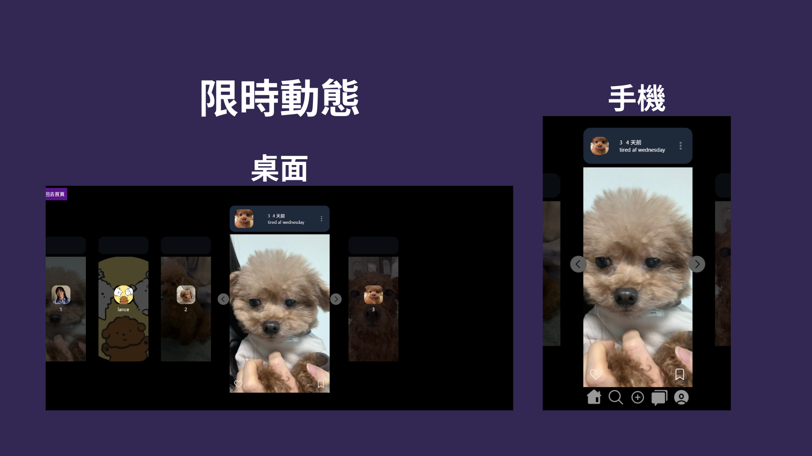

# Bookmark 
## 全端社交平台 (MERN stack)

 

### DEMO連結
https://bookmark-frontend-gamma.vercel.app/

### 專案介紹
Bookmark 是一個全端社交平台 Side Project，
目的是練習 Full Stack 開發流程 以及 RWD 響應式設計。
- 註冊、登入、登出
- 建立貼文跟限時動態
- 按讚、留言、收藏
- RWD 響應式設計（支援手機 / 平板 / 桌機）
- 前後端分離部署

### 技術棧
前端
- React
- React HashRouter
- TailwindCSS
- 部署平台：Vercel

後端
- Node.JS
- Express.JS
- MongoDB
- JWT Authentication
- 部署平台：Render

### 學到重點
- TailwindCSS
- RWD 響應式設計
- REST API設計
- JWT 使用者驗證機制
- MongoDB 資料模型設計
- Full Stack 部署流程
- Git / GitHub 版本控制管理

## 展示
### 登入

### 註冊

### 首頁

### 搜尋

### 聊天室

### 個人檔案

### 建立

### 限時動態

